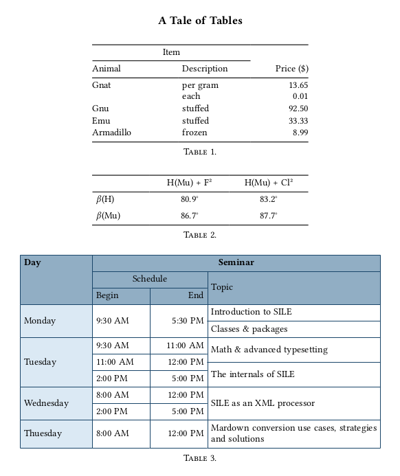
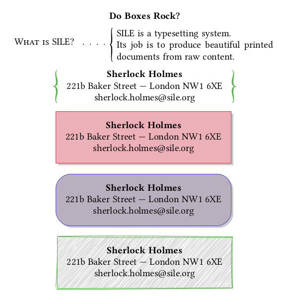

# ptable.sile

[](LICENSE)
[](https://github.com/Omikhleia/ptable.sile/actions?workflow=Luacheck)
[](https://luarocks.org/modules/Omikhleia/ptable.sile)

This package collection for the [SILE](https://github.com/sile-typesetter/sile) typesetting
system provides struts, paragraph boxes (parbox), framed boxes (framebox) and
tables (ptable).

The two first are building blocks:

- In professional typesetting, a “strut” is a rule with no width but a certain
  height and depth, to help guaranteeing that an element has a certain minimal
  height and depth, e.g. in tabular environments or in boxes.
- A paragraph box (“parbox”) is an horizontal box (so technically an “hbox”)
  that contains, as its name implies, one or more paragraphs (so the displayed
  content is actually made of vertical glues and boxes)

Tables are what you would expect.



As the name implies, framed boxes are horizontal content framed in a nice
box. The package offers various interesting options and goodies.



## Installation

These packages require SILE v0.14 or upper.

Installation relies on the **luarocks** package manager.

To install the latest version, you may use the provided “rockspec”:

```
luarocks install ptable.sile
```

(Refer to the SILE manual for more detailed 3rd-party package installation information.)

## Usage

Examples are provided in the [examples](./examples) folder.

The in-code package documentation may also be useful.
A readable version of the documentation is included in the User Manual for
the [resilient.sile](https://github.com/Omikhleia/resilient.sile) collection
of classes and packages.

## License

All SILE-related code and samples in this repository are released under the MIT License, (c) 2021-2023 Omikhleia.
